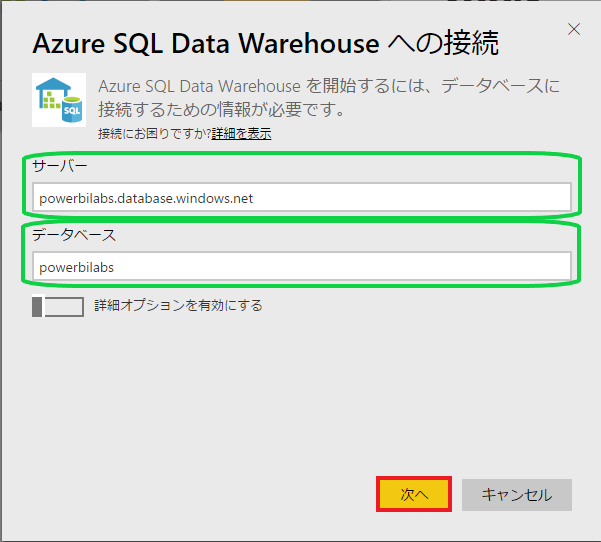
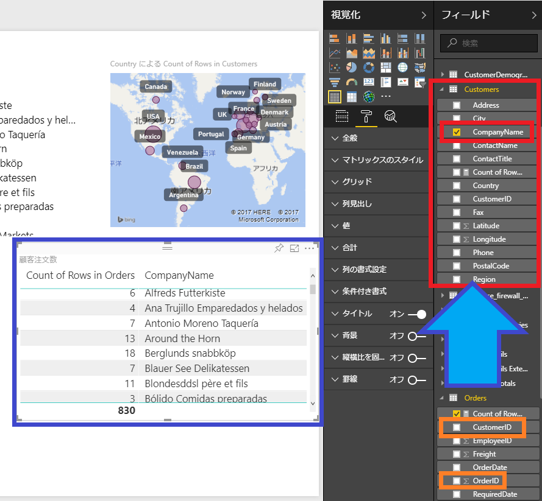
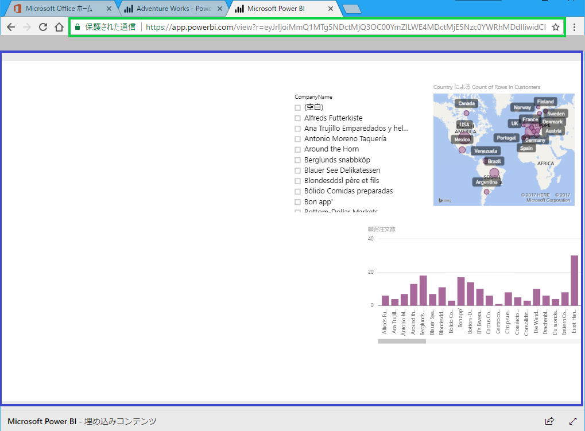

# Microsoft Power BI を使用した データの考察と視覚化
## 概要
 *Microsoft Power BI* は、商業組織や学術組織におけるデータの爆発的な増加に対処し、データの分析機能に対するニーズや、対話型の高度なビジュアルによってデータを表現したり重要な洞察を示したりするための機能に対するニーズを満たすことを目的として開発されました．*Microsoft Power BI* には、データの検出および収集から、データの変換、集計、視覚化、共有、コラボレーションまで、データ分析のライフサイクル全体を支援する一連のツールが含まれています．また、コードをまったく記述することなく高度な視覚エフェクト (ビジュアル) を作成し、対話型のダッシュボードで提示することもできます．
 *Power BI* では、組織内のすべてのデータを整理統合することによって、組織の状況をわかりやすくかつリアルタイムに把握することができます．*Power BI* の機能には、さまざまなサービスおよびアプリケーション用のデータ コネクター、一般的なファイル形式およびデータベースのサポート、フル装備の表現エンジン、洗練された視覚エフェクトを作成できる *WYSIWYG* エディター、*Web* 上や *iOS*、*Android*、または *Windows* を実行するモバイル デバイス上でのデータの視覚化のサポート、独自の *Web* アプリやモバイル アプリへの視覚エフェクトの埋め込みのサポートなどがあります．

iOSおよび *Windows* 上で動作する対話型の *Power BI* ダッシュボード

このラボでは、*Microsoft Power BI* を使用して、架空の会社の売上データを表示し、この売上データの視覚エフェクトを組み込んだレポートとダッシュボードを作成します．ここでは、レポート作成の基礎を学習するとともに、作成したレポートを組織の内外のほかの人々と共有するためのさまざまな方法を学習します．

---

## 目的
### このハンズオン ラボでは、以下の方法について学習します．
* [Power BIからビジネスデータに接続する](#ex1)
* [ダッシュボードでビジネスデータを視覚化する](#ex2)
* [作成した視覚エフェクトおよびレポートをさらに改善する](#ex4)
* [Power BIコンテンツを公開し、共有する](#ex5)

---

## 前提条件
### このハンズオン ラボを完了するには、以下が必要です．
* アクティブなMicrosoft Office 365 サブスクリプション、または無料試用版へのサインアップ
* アクティブなMicrosoft Power BIサブスクリプション、または無料試用版へのサインアップ

---
## 演習
### このハンズオン ラボでは次の演習を行います．
* [演習 1: データベースへの接続](#ex1)
* [演習 2: データの視覚エフェクトの作成](#ex2)
* [演習 3: 関連する視覚エフェクトの追加](#ex3)
* [演習 4: 作成した視覚エフェクトの改善](#ex4)
* [演習 5: コンテンツの公開と共有](#ex5)
### このラボの推定所要時間: 60 分

---
##  演習 1: データベースへの接続
*Microsoft Power BI* を使用したデータの考察と視覚化の最初の手順は、データ ソースに接続することです．この演習では、*Adventure Works* という架空の会社の顧客、製品、および売上に関するデータが格納された *Azure SQL Server* データベースに接続します．

1. [https://powerbi.microsoft.com](https://powerbi.microsoft.com) で *Power BI* サービス ポータルを開きます．*Power BI* にサインインしていない場合は、**[Sign In]** をクリックし、*Microsoft Office 365* アカウントでログインします．

2.	ハンバーガー アイコンをクリックしてサイド メニューを開き、**[データの取得]** をクリックします．

    
    ##### データ ソースにアクセス

3. **[データのインポートまたは接続]** で、**[データベース]** タイルにある **[取得 ↗]** をクリックします．

    
    ##### データベースにアクセス

4. **[Azure SQL Data Warehouse]** をクリックします．次にタイルの下に表示されるプルアウト メニューで **[接続]** をクリックします．

    - "このコンテンツ パックは *Power BI Pro* の機能です" という通知が表示されたら、*Power BI Pro* の無料試用版受け入れます．その後、この手順を繰り返して *Azure SQL Data Warehouse* に接続します．

    
    ##### Azure SQL Data Warehouse にアクセス

5. **[Azure SQL Data Warehouse への接続]** ダイアログでサーバーとデータベースを入力します．その後、**[次へ]** ボタンをクリックします．
    - サーバー : 「powerbilabs.database.windows.net」
    - データベース : 「powerbilabs」 

    
    ##### SQL Server データベースに接続

6. ユーザー名とパスワードを入力します(いずれも、かぎかっかは付けません)．そして **[Sign in]** をクリックすると、*Azure SQL Warehouse* と *Adventure Works* データベースに接続されます．
    - ユーザー名 :「PowerBILabUser」
    - パスワード : 「PowerBI_1」

    
    ##### SQL Server の資格情報を入力

7. サイドメニューが表示されていない場合は、ハンバーガー アイコンをクリックしてこのメニューを開き、**[データセット]** の下のメニューに **[powerbilabs]** という新しい項目が表示されているのを確認します．

    
    ##### 新たなデータセット

これで、*Azure SQL DataWarehouse* にホストされている *Adventure Works* データベースのインスタンスに接続されました．
次は、このデータベース内の一部のデータについて示すレポートを作成します．

---
---
##  演習 2: データの視覚エフェクトの作成
*Power BI* の中心的な機能は、ダッシュボードやレポートを通じて高度な視覚エフェクトをユーザーに提示できることです．この演習では、*Adventure Works* データベースの 1 つのテーブルのデータを表示するレポートを作成します．
1. サイド メニューの **[powerbilabs]** をクリックして、このデータセットをレポート デザイナーで開きます．

    
    ##### powerbirabs データセットを開く

2. レポート デザイナーの **[視覚化]** パネルで、テーブルのアイコンをクリックして、空のテーブル視覚エフェクトをワークスペースに追加します．

    
    ##### テーブル視覚エフェクトを追加

3. このテーブル視覚エフェクトからデータに接続するために、**[フィールド]** パネルにある **[Customers]** をクリックします．それにより、データベースの *Customers* テーブルのフィールドが表示されます．

    
    ##### Customers テーブルを選択

4. **[CompanyName]**、**[ContactName]**、**[Phone]** のチェック ボックスをオンにして、これらのフィールドをテーブル視覚エフェクトに追加します．
    -テーブル視覚エフェクトの境界に表示される方向ハンドルをドラッグすることで、テーブルのサイズを必要に応じて変更できます．

    
    ##### Customers テーブルのフィールドを選択

5. レポートの視覚エフェクトを対話モードで表示するには、**[読み取りビュー]** をクリックします．レポートを保存するように求められたら、**[保存]** をクリックして、「Adventure Works」という名前を入力します (かぎかっこは付けません)．
    - 対話モードでは、視覚エフェクトに対して、並べ替え、グループ化、ほかのレポート要素へのドリルダウンなどのアクションを実行できます．

    
    ##### 読み取りビューに切り替え

    
    ##### 保存を選択

    
    ##### レポート名を入力

6. *CompanyName* 列のヘッダーにある矢印をクリックすると、並べ替えの方向が変わります．

    
    ##### 並べ替え方向を切り替え

7. トップ メニューの **[レポートの編集]** をクリックして、対話モードを終了します．

    
    ##### 対話モードを終了

8. 視覚エフェクトに表示されているフィールドを変更するために、**[フィールド]** パネルに移動し、*Customers* テーブルのすべてのフィールドのチェック ボックスをオフにします．それから、**[Products by Category]** をクリックし、下に表示される項目の中から **[CategoryName]** と **[ProductName]** のチェック ボックスをオンにします．選択した値でテーブル視覚エフェクトが更新されます．

    
    ##### テーブル視覚エフェクトのフィールドを変更

9. トップ メニューの **[保存]** をクリックして、レポートを保存します．

    
    ##### レポートの保存

1 つのテーブルからのレポートの作成は簡単に行えます．視覚エフェクトでの表示対象とするフィールドのチェック ボックスをオンにすればいいだけです．この演習ではテーブルの視覚エフェクトを使用しましたが、ほかにも多数の視覚エフェクトを選択できます．ほかの視覚エフェクトを自由に選択して、さまざまな方法でデータの視覚化を試してみてください．

---
---

##  演習 3: 関連するデータ視覚エフェクトの追加
これで、単純な視覚エフェクトの作成方法を習得できました．これがわかれば、関連する視覚エフェクトの追加や、ほかの種類の視覚エフェクトの作成も容易に行えます．前の演習では、テーブルの視覚エフェクトを使用して製品データを示しました．この演習では、テーブル視覚エフェクトとマップ視覚エフェクトを使用して顧客データを操作します．

1. 既存のテーブル視覚エフェクトを削除する為に、右上隅にある省略記号 **(...)** をクリックし、**[削除]** をクリックします．

    
    ##### 視覚エフェクトを削除

    
    ##### 他のテーブルなどが無いかを確認

2. [視覚化] パネルでテーブルのアイコンをクリクして、空のテーブル視覚エフェクトをワークスペースに追加します．

    
    ##### テーブル視覚エフェクトを追加

3. **[フィールド]** パネルで **[Customers]** の下にある **[CompanyName]** と **[Count of Rows]** のチェック ボックスをオンにします．

    
    ##### Customersテーブルのフィールドを選択

4. レポート デザイナーに新しい視覚エフェクトを受け入れさせるために、レポート デザイナーの表面の空白の領域をクリックします．

5. **[Orders]** の下にある **[CustomerID]**、**[OrderID]**、および **[Count of Rows]** のチェック ボックスをオンにします．レポート デザイナーによって、新しいテーブル視覚エフェクトが自動的に作成されるのを確認します．

    
    ##### Orders テーブルのフィールドを選択

6. レポート デザイナーに新しい視覚エフェクトを受け入れさせるために、レポート デザイナーの表面の空白の領域をクリックします．

7. **[視覚化]** パネルで「スライサー」のアイコンをクリックして、スライサーの視覚エフェクトを追加します．次に、**[フィールド]** パネルで、**[Customers]** の下にある **[CompanyName]** のチェック ボックスをオンにします．スライサー視覚エフェクトに顧客の一覧が読み込まれます．
    - スライサーの目的は、ほかの視覚エフェクトに表示されているデータセットを絞り込むことです．どちらの視覚エフェクトにも関連データが含まれているため、Power BI は自動的にこれらのリレーションシップを理解し、関連する要素で実行されたアクションに反応します．

    
    ##### スライサー視覚エフェクトを追加

    
    ##### 現在の画面

8. 関連する 2 つの視覚エフェクトがどのように相互作用するか実際に確認するために、スライサー視覚エフェクトで **[Around the Horn]** をクリックします．それにより、テーブル視覚エフェクトが更新され、選択した顧客の受注情報が表示されます．
    - スライサーで複数の顧客を選択する場合は、Ctrl キーを押しながらそれぞれの顧客のチェック ボックスをオンにします．

    
    ##### 特定の顧客のデータを表示

    
    ##### 複数の特定の顧客のデータを表示

9. **[Around the Horn]** のチェック ボックスをもう一度クリックして、オフにします．

10. ここまでの演習では、単純なデータの一覧を操作しました．**[視覚化]** パネルで別の種類の視覚エフェクトを選択して、より魅力的な視覚エフェクトを作成することもできます．実際にやってみましょう．まず、*Customer*、*CompanyName*、*Count of Rows* を示すテーブル視覚エフェクトを選択します．

11. 最初に作成したテーブルの **[フィールド]** パネルの **[Customers]** セクションで、**[CompanyName]** のチェック ボックスをオフにし、**[Country]** のチェック ボックスをオンにします．

    
    ##### 視覚エフェクトに表示するフィールドを変更

12. **[視覚化]** パネルで「ArcGIS Maps for Power BI」マップのアイコンをクリックして、テーブル視覚エフェクトがどう変わるか確認します．テーブル視覚エフェクトがインタラクティブ マップに変わり、国別の顧客数を示す比例サイズのマップ要素 (緑の円) が表示されます．顧客数は *Count of Rows* フィールドの値に基づいています．では、マップ内のいずれかの緑の円の上にマウスのカーソルを置いてみましょう．その国の顧客数に関する情報を示すヒントが表示されます．

    
    ##### テーブルを **[マップ]** に変更

    
    ##### 試しに **[北アメリカ]** を選択し上の青枠の合計を見てみましょう

    
    ##### 複数選択する際は、Ctrl + 左クリック

13. トップ メニューの **[保存]** をクリックして、レポートの変更内容を保存します．

    
    ##### レポートを保存

    
    ##### 保存完了

マップ視覚エフェクトは、より充実した視覚エフェクトの作成に向けた適切な一歩ではありますが、現在のレポートはまだいささか地味です．次の演習では、*Power BI* のレポート書式設定オプションをいくつか使用して、外観を磨き上げます．

---
---

##  演習 4: 作成した視覚エフェクトの改善
データにどんなに価値や妥当性があっても、わかりやすく、かつ魅力的な外観で表現されていなければ、データの閲覧者は、そのデータから意味を引き出すのは難しいと感じるでしょう．閲覧者の注意を引き付け、有意義な方法でデータを提示する最も効果的な方法の 1 つは、視覚エフェクトをさらに改善するための書式設定などの機能を適用することです．この演習では、作成した視覚エフェクトをさらに改善し、レポートの見栄えをよくします．

1. スライサー視覚エフェクトのヘッダーをクリックして、スライサーを選択します．

    
    ##### スライサー選択

2. [視覚化] パネルで書式設定のアイコンをクリックします．

    
    ##### 書式設定オプションを表示

3. **[項目]** をクリックして、**[項目]** パネルを展開します．次に、**[フォントの色]** の横にあるカラー ピッカーを使用してフォントの色を黒に設定します．

    
    ##### フォントの色を黒色の変更

4. 文字のサイズを **12** に変更します．

    
    ##### 文字サイズを変更

    

5. テーブル視覚エフェクトのヘッダー(どこでも良い)をクリックして、テーブルを選択します．

    
    ##### テーブル視覚エフェクト

6. **[視覚化]** パネルで書式設定のアイコンをクリックします．次に、各パネルを展開して文字のサイズを **12** に設定します．

    
    ##### **[列見出し]** の文字サイズを **[12]**

    
    ##### **[値]** 文字サイズ **[12]**

    
    ##### **[合計]** 文字サイズ **[12]**

    
    ##### 完成形

7. **[タイトル]** パネルを展開し、スライダーをクリックして **[オフ]** から **[オン]** に変更します．次に、**[タイトル テキスト]** ボックスに「顧客注文数」と入力します (かぎかっこは付けません)．

    
    ##### 視覚エフェクトのタイトルを編集

8. マップ視覚エフェクトのヘッダーをクリックして、マップを選択します．

    
    ##### マップ視覚エフェクトを選択

9. **[視覚化]** パネルで書式設定のアイコンをクリックします．次に、**[データの色]** パネルを展開し、**[既定色]** の横にあるカラー ピッカーを使用して既定色を**紫**に設定します．

    
    ##### マップの既定色の変更

10. **[カテゴリ ラベルの表示]** の横にあるスライダーをクリックして **[Off]** から **[On]** に変更し、マップのラベルをオンにします．

    
    ##### マップのラベルをオンに設定

11. テーブル視覚エフェクトのヘッダーをクリックして、テーブルを選択します．

12. **[フィールド]** パネルで *Customers* テーブルを見つけ、**[CompanyName]** のチェック ボックスをオンにします．次に、*Orders* テーブルに進み、**[CustomerID]** と **[OrderId]** のチェック ボックスをオフにします．

    
    ##### テーブル視覚エフェクトに表示するフィールドを変更

13. **[視覚化]** パネルで「積み上げ縦棒グラフ」のアイコンをクリックして、テーブル視覚エフェクトを積み上げ縦棒グラフに変更します．

    
    ##### テーブル視覚エフェクトを積み上げ縦棒グラフに変更

14. **[視覚化]** パネルで書式設定のアイコンをクリックします．次に、**[データの色]** パネルを展開し、**[既定色]** の横にあるカラー ピッカーを使用して既定色を紫に設定します．

    
    ##### グラフの既定色を変更

15. トップ メニューの **[保存]** をクリックして、レポートの変更内容を保存します．

    
    ##### レポートを保存

ほかの値も自由に調整し、さまざまな視覚エフェクトを試して、データがどのように表示されるか確認してください．書式設定の変更が適切に行えたら、次の手順はレポートの共有です．

---
---

##  演習 5: コンテンツの公開と共有
*Power BI* では、自分のコンテンツを公開して、組織の内外のユーザーやユーザー グループと共有する操作を容易に行えます．この演習では、前の演習で作成したレポートをダッシュボードに挿入し、そのダッシュボードをほかの *Power BI* ユーザーと共有する方法を学習します．この演習によって、*Power BI* の "Web に公開" 機能を使用した、外部ユーザーとのコンテンツの共有方法を理解できます．

1. *Adventure Works* ダッシュボードのトップ メニューにある **[ライブ ページをピン留めする]** をクリックします．

    
    ##### ライフページをピン留め

2. **[新しいダッシュボード]** をクリックし、ダッシュボードのタイトルとして「Adventure Works」を入力して (かぎかっこは付けません)、**[ライブをピン留めする]** をクリックします．

    
    ##### 新しいダッシュボードを作成

    
    ##### [ダッシュボードへ移動]か右上の☓印を押して閉じてください．

3. サイド メニューの **[ダッシュボード]** セクションで **[Adventure Works]** をクリックします．

    
    ##### Adventure Works ダッシュボードを選択

4. ダッシュボードの右上隅にある **[共有]** をクリックします．

    
    ##### ダッシュボードを共有

5. 電子メール アドレス ボックスに、*Office 365* の自分の電子メール アドレス (*Power BI* へのログインに使用したもの) を入力します．次に、**[共有]** をクリックすると、*Adventure Works* ダッシュボードへのリンクが自分の電子メール アドレスに送信されます．
    - この場合、ダッシュボードの共有相手は自分自身のみですが、入力する電子メール アドレスの一覧に、共有相手とする *Power BI* ユーザーの電子メール アドレス (*Power BI* へのアクセスに使用するアドレス) を含めることによって、任意の *Power BI* ユーザーとダッシュボードを共有できます．

    
    ##### 受信者の一覧を入力

    
    ##### **[成功しました！]** と出たら特定の相手への共有完了

6. *Outlook* の受信箱を確認します．*Power BI* からメールが届いてるのでクリックしメールを開き、**[Open Adventure Works]** をクリックして、*Web* サイトを確認してみましょう．

    
    ##### Adventure Works をクリック

7. この方法でダッシュボードを共有した場合、ダッシュボードはアクセスを許可したユーザーのみ、*Web* サイトで表示されます．

    
    ##### Web サイトで確認

8. ダッシュボードへアクセス出来るユーザを確認を行う場合は、再度 **[共有]** をクリックします．**[アクセス]** をクリックし、**[このダッシュボードへのアクセス権を持つ相手]** の下に表示された名前を確認します．その後 **[閉じる]** ボタンをクリックして **[ダッシュボードの共有]** パネルを閉じます．

    
    ##### アクセス可能ユーザ一覧の表示

9. *Power BI* は、公開 *Web* サイトへのレポートの埋め込みや、*URL* を使用したレポートの公開共有を行える "Web に公開" 機能も備えています．この機能を実際に確認してみましょう．*Power BI* サービス ポータルに戻り、サイド メニューの **[Reports]** セクションで **[Adventure Works]** をクリックして、このレポートを開きます．

    
    ##### Adventure Works レポートを開く

10. レポートの左上隅にある **[ファイル]** メニューをクリックし、**[Web に公開]** をクリックします．

    
    ##### Webに公開

11. **[埋め込みコードの作成]** をクリックします．

    
    ##### 埋め込みコードを作成

12. **[発行]** をクリックします．

    
    ##### レポートを公開

13. 表示されるダイアログには 2 つの重要な値が含まれています．(*Power BI* ユーザーであるかを問わず) あらゆる人とのレポートの共有に使用できるリンクと、*Web* ページにレポートを埋め込むためにページに貼り付けることができる [IFRAME](http://www.htmq.com/html/iframe.shtml) です．これらの値を確認したら、**[閉じる]** をクリックしてダイアログを閉じます．

    
    ##### レポートを公開共有するための値

14. **[メールで送信出来るリンク]** をコピーして、他のブラウザーなどで閲覧を行うと権限が無くても閲覧をすることが出来ます．
    
    ##### 上のリンクを表示

*Power BI* コンテンツの公開と共有はこのように簡単に行えます。以上で *Power BI* を使ったこのラボはこれで終了です．

---
---

## まとめ
このハンズオン ラボでは、以下の方法について学習しました。
- [Power BI からビジネス データに接続する](#ex1)
- [ダッシュボードでビジネス データを視覚化する](#ex2)
- [作成した視覚エフェクトにリレーションシップを追加する](#ex3)
- [書式設定によって視覚エフェクトおよびレポートをさらに改善する](#ex4)
- [Power BI コンテンツを公開し、共有する](#ex5)

*Power BI* の威力を活用する方法はほかにもまださくさんありますが、このラボでは手始めに基本を学習しました。*Power BI* の機能をじっくりと試し、プロセスへの *Power BI* の統合を通じてビジネス インテリジェンスを高めるためのその他の方法を確認してください。
________________________________________
*Copyright 2017 Microsoft Corporation. All rights reserved.* 特に注記がない限り、これらの資料は MIT ライセンスの使用条件下でライセンス供与されます。これらの資料は、MIT ライセンスに従い、プロジェクトに最も適切と判断された場合は使用することができます。このライセンスの使用条件については、[https://opensource.org/licenses/MIT](https://opensource.org/licenses/MIT) を参照してください。
